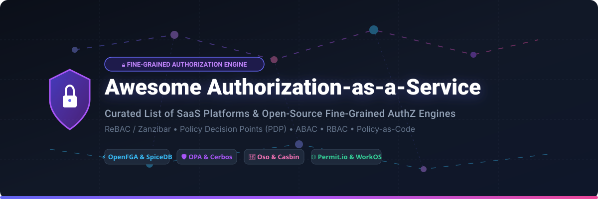

# 🔐 Awesome Authorization-as-a-Service (AuthZaaS) & Fine-Grained Permissions Ecosystem

**Curated directory of SaaS products & Open-Source Fine-Grained Authorization (FGA) engines**  
*Focused on ReBAC (Google Zanzibar), Policy Decision Points (PDP), ABAC, RBAC, Policy-as-Code & Externalized Authorization*

---

## 📖 Introduction & Overview

Welcome to the **Awesome Authorization-as-a-Service** repository! Modern cloud-native microservices, multi-tenant SaaS platforms, and AI agent architectures are increasingly decoupling authorization logic from application code. By externalizing access control decisions using **Fine-Grained Authorization (FGA)**, **Relationship-Based Access Control (ReBAC)**, **Attribute-Based Access Control (ABAC)**, and **Policy Decision Points (PDP)**, security teams and software engineers maintain consistent, auditable, and instant permissions across all workloads without redeploying code.

This curated list benchmarks leading commercial **SaaS platforms** and **Open-Source GitHub projects**, complete with pricing, free tier quotas, company valuation data, GitHub star rankings, and architectural capabilities.

---

## 📑 Table of Contents

- [☁️ SaaS & Hosted Authorization Platforms](#️-saas--hosted-authorization-platforms)
- [🔓 Open-Source GitHub Projects](#-open-source-github-projects)
- [🧩 Architecture & Model Cheat Sheet](#-architecture--model-cheat-sheet)
- [🤝 How to Contribute](#-how-to-contribute)
- [⚖️ Disclaimer & Security Guidance](#️-disclaimer--security-guidance)

---

## ☁️ SaaS & Hosted Authorization Platforms

> 📊 **Sector Market Size & Dynamics**: The global Authorization-as-a-Service & Fine-Grained Access Control (AuthZ / FGA) market is estimated at **~$3.2 Billion in 2026** (projected to reach **$6.8 Billion by 2030** at a **~16.5% CAGR**). The market is currently **highly fragmented**, characterized by competing architectural paradigms (Google Zanzibar ReBAC relationship stores, Rego/Cedar Policy-as-Code PDPs, and traditional ABAC/RBAC engines) with no single monopolistic winner-take-all enterprise vendor yet.

Below is a curated table of commercial Authorization-as-a-Service SaaS vendors, sorted by **Estimated Company Valuation / Capital Raised (Descending)**:

| 🏢 Product / Platform | 📝 Description & Focus | 💰 Est. Valuation / Total Raised | 💳 Starting Paid Tier Price | 🎁 Free Tier / Trial Limits |
| :--- | :--- | :--- | :--- | :--- |
| **[WorkOS (FGA)](https://workos.com/)** | Fine-grained AuthZ, FGA, SSO, Directory Sync & RBAC infrastructure for enterprise SaaS apps. | **~$2.0 Billion Valuation** ($198M Raised) | **$125 / month** *(Starter Plan)* | **1,000,000 requests / mo** *(or 10,000 MAUs free)* |
| **[Descope](https://www.descope.com/)** | Drag-and-drop customer authentication & fine-grained authorization platform with visual workflows. | **~$500 Million Valuation** ($88M Raised) | **$249 / month** *(Pro Plan)* | **7,500 MAUs** *(Free forever)* |
| **[PlainID](https://www.plainid.com/)** | Enterprise Policy-Based Access Control (PBAC) & identity authorization governance for complex IT environments. | **~$350 Million Valuation** ($96M Raised) | **$8,333 / month** *($100k/yr base enterprise)* | **30-Day Free Trial** *(Up to 5 sandbox envs)* |
| **[Styra DAS](https://www.styra.com/)** | Enterprise declarative policy control plane & management hub built on Open Policy Agent (OPA). | **~$200 Million Valuation** ($67.5M Raised) | **$250 / month** *(Pro Plan)* | **14-Day Free Trial** *(Up to 10k evals/mo & 3 clusters)* |
| **[Oso Cloud](https://osohq.com/)** | Managed fine-grained authorization service powered by the declarative Polar policy language. | **~$75 Million Valuation** ($25.9M Raised) | **$15 / user / month** *(or $250/mo team tier)* | **1,000 MAUs & 10k checks / mo** *(Free forever)* |
| **[AuthZed (SpiceDB Cloud)](https://authzed.com/)** | Managed Google Zanzibar-style relationship graph permission platform with strong global consistency. | **~$60 Million Valuation** ($15.8M Raised) | **$2.00 / hour** *(~$1,440/mo metered serverless)* | **1,000 tuples & 10k ops / mo** *(Free forever)* |
| **[Permit.io](https://www.permit.io/)** | No-code/low-code authorization control plane with OPAL PDP sidecars, audit logs & RBAC/ABAC UI. | **~$50 Million Valuation** ($14M Raised) | **$249 / month** *(Team Plan)* | **1,000 MAUs** *(Free forever)* |
| **[Axiomatics](https://www.axiomatics.com/)** | Enterprise Attribute-Based Access Control (ABAC) decision engine & policy enforcement point solution. | **Acquired by Leonardo** *(~$50M Enterprise IAM)* | **$3,000 / month** *(Base enterprise tier)* | **30-Day Free Trial** *(Enterprise evaluation sandbox)* |
| **[Cerbos Hub](https://www.cerbos.dev/)** | Managed control plane, policy playground, and CI/CD workflow automation for stateless Cerbos PDPs. | **~$35 Million Valuation** ($10.6M Raised) | **$25 / month** *(Growth Plan)* | **2 devs, 1 workspace & 5 tenants** *(Free forever)* |
| **[Aserto](https://www.aserto.com/)** | Fine-grained authorization platform with managed edge authorizers powered by Open Policy Agent & Topaz. | **~$20 Million Valuation** ($5.1M Raised) | **$0.20 / user / month** *(Essentials Plan)* | **1,000 users, 50 repos & 100 authorizers** *(Free forever)* |

---

## 🔓 Open-Source GitHub Projects

Open-source fine-grained authorization engines provide full control, self-hostability, privacy, and high performance. Below are top production-proven open-source projects, sorted by **GitHub Star Count (Descending)**:

### 1. 🏆 **Casbin** (`apache/casbin`)
- **Star Rating**: ⭐ 
- **Primary Language**: Go (SDKs in 10+ languages)
- **License**: Apache-2.0
- **Description**: An embeddable open-source authorization library supporting ACL, RBAC, ABAC, RESTful, and domain-based access control models via flexible CONF policy definition files.
- **Website**: [casbin.org](https://casbin.org) | **GitHub**: [github.com/casbin/casbin](https://github.com/casbin/casbin)

---

### 2. 🚀 **SuperTokens Core** (`supertokens/supertokens-core`)
- **Star Rating**: ⭐ 
- **Primary Language**: Java / TypeScript
- **License**: Apache-2.0
- **Description**: Open-source user authentication & user-role authorization solution with session management, multi-tenancy, and user management APIs.
- **Website**: [supertokens.com](https://supertokens.com) | **GitHub**: [github.com/supertokens/supertokens-core](https://github.com/supertokens/supertokens-core)

---

### 3. 🌐 **Open Policy Agent (OPA)** (`open-policy-agent/opa`)
- **Star Rating**: ⭐ 
- **Primary Language**: Go
- **License**: Apache-2.0 (CNCF Graduated)
- **Description**: CNCF Graduated general-purpose open policy decision engine using the declarative Rego language for microservice HTTP authorization, Kubernetes admission control, and infrastructure compliance.
- **Website**: [openpolicyagent.org](https://www.openpolicyagent.org) | **GitHub**: [github.com/open-policy-agent/opa](https://github.com/open-policy-agent/opa)

---

### 4. 🔒 **SpiceDB** (`authzed/spicedb`)
- **Star Rating**: ⭐ 
- **Primary Language**: Go
- **License**: Apache-2.0
- **Description**: Open-source, Google Zanzibar-inspired permission database created by AuthZed, designed to store and evaluate relationship tuples (`user:alice is reader of doc:1`) with strong consistency.
- **Website**: [authzed.com/spicedb](https://authzed.com/spicedb) | **GitHub**: [github.com/authzed/spicedb](https://github.com/authzed/spicedb)

---

### 5. ⚡ **Permify** (`Permify/permify`)
- **Star Rating**: ⭐ 
- **Primary Language**: Go
- **License**: Apache-2.0
- **Description**: Open-source Google Zanzibar-based authorization service designed to build scalable, multi-tenant permission systems using custom DSL schemas and context-aware checks.
- **Website**: [permify.co](https://permify.co) | **GitHub**: [github.com/Permify/permify](https://github.com/Permify/permify)

---

### 6. 🛡️ **OpenFGA** (`openfga/openfga`)
- **Star Rating**: ⭐ 
- **Primary Language**: Go
- **License**: Apache-2.0 (CNCF Incubating)
- **Description**: CNCF Incubating relationship-based authorization engine inspired by Google Zanzibar, created by Okta/Auth0 for high-performance fine-grained authorization (FGA) with DSL & JSON schemas.
- **Website**: [openfga.dev](https://openfga.dev) | **GitHub**: [github.com/openfga/openfga](https://github.com/openfga/openfga)

---

### 7. 🔑 **Ory Keto** (`ory/keto`)
- **Star Rating**: ⭐ 
- **Primary Language**: Go
- **License**: Apache-2.0
- **Description**: Open-source implementation of Google's Zanzibar paper written in Go, forming the relationship-based access control layer of the Ory identity & security ecosystem.
- **Website**: [ory.sh/keto](https://www.ory.sh/keto) | **GitHub**: [github.com/ory/keto](https://github.com/ory/keto)

---

### 8. 📦 **Cerbos** (`cerbos/cerbos`)
- **Star Rating**: ⭐ 
- **Primary Language**: Go
- **License**: Apache-2.0
- **Description**: Open-source stateless policy decision point (PDP) using human-readable YAML/JSON policies, AuthZEN standards compliance, and container sidecar or microservice deployments.
- **Website**: [cerbos.dev](https://www.cerbos.dev) | **GitHub**: [github.com/cerbos/cerbos](https://github.com/cerbos/cerbos)

---

### 9. 🐻 **Oso** (`osohq/oso`)
- **Star Rating**: ⭐ 
- **Primary Language**: Rust / Python / Node / Go
- **License**: Apache-2.0
- **Description**: Open-source authorization framework and Polar declarative policy language for embedding granular access control rules directly inside application code.
- **Website**: [osohq.com](https://www.osohq.com) | **GitHub**: [github.com/osohq/oso](https://github.com/osohq/oso)

---

### 10. ☕ **jCasbin** (`casbin/jcasbin`)
- **Star Rating**: ⭐ 
- **Primary Language**: Java
- **License**: Apache-2.0
- **Description**: Java edition of the Casbin authorization library supporting Spring Boot, Quarkus, Micronaut, and enterprise JVM permission management.
- **Website**: [casbin.org](https://casbin.org) | **GitHub**: [github.com/casbin/jcasbin](https://github.com/casbin/jcasbin)

---

### 11. 🐍 **PyCasbin** (`casbin/pycasbin`)
- **Star Rating**: ⭐ 
- **Primary Language**: Python
- **License**: Apache-2.0
- **Description**: Python implementation of Casbin access control framework for Django, FastAPI, Flask, and AsyncIO microservices.
- **Website**: [casbin.org](https://casbin.org) | **GitHub**: [github.com/casbin/pycasbin](https://github.com/casbin/pycasbin)

---

### 12. 🌲 **Cedar Policy** (`cedar-policy/cedar`)
- **Star Rating**: ⭐ 
- **Primary Language**: Rust
- **License**: Apache-2.0
- **Description**: AWS open-source policy language and SDK for expressive, fast, and provably secure deterministic authorization logic.
- **Website**: [cedarpolicy.com](https://www.cedarpolicy.com) | **GitHub**: [github.com/cedar-policy/cedar](https://github.com/cedar-policy/cedar)

---

### 13. 💎 **Topaz** (`aserto-dev/topaz`)
- **Star Rating**: ⭐ 
- **Primary Language**: Go
- **License**: Apache-2.0
- **Description**: Open-source authorization engine combining Open Policy Agent (OPA) Rego policies with Google Zanzibar relationship-based access control (ReBAC).
- **Website**: [topaz.sh](https://www.topaz.sh) | **GitHub**: [github.com/aserto-dev/topaz](https://github.com/aserto-dev/topaz)

---

## 🧩 Architecture & Model Cheat Sheet

| Authorization Model | Core Concept | Ideal Use Cases | Top Open-Source Engines |
| :--- | :--- | :--- | :--- |
| **ReBAC (Google Zanzibar)** | Relationship graph tuples (`subject` -> `relation` -> `object`) | Multi-tenant SaaS, Google Drive file sharing, nested team hierarchies | OpenFGA, SpiceDB, Permify, Ory Keto |
| **Policy-as-Code (ABAC/PDP)** | Centralized rules evaluated against context attributes (time, IP, role) | Microservices, Kubernetes admission, enterprise API gateways | Open Policy Agent (OPA), Cerbos, Cedar |
| **Embedded Library** | In-process rule evaluation directly linked in app memory | Single monoliths, low-latency offline checks, embedded tools | Casbin, Oso, PyCasbin, jCasbin |

---

## 🤝 How to Contribute

Contributions are welcome! Please follow these simple guidelines:

1. **Fork the Repository**: Create your feature branch (`git checkout -b add-new-authz-tool`).
2. **Add Entry**: Include Name, Website URL, GitHub URL, factual description, starting price, and free tier quotas.
3. **Verify Links & Format**: Ensure markdown formatting and table alignment remain clean.
4. **Open Pull Request**: Submit a detailed PR explanation.

---

## ⚖️ Disclaimer & Security Guidance

- **Community Curated**: This is a community-driven repository. Inclusion does not imply official commercial endorsement.
- **Least Privilege Enforcement**: Authorization models dictate real-world security. Always rigorously audit and test policy rules, log decision evaluations, and ensure identity claims (OIDC/JWT) originate from trusted IdPs.
- **Operational Responsibility**: Operating open-source engines (SpiceDB, OpenFGA, OPA) requires managing database backends, caching, and PDP sidecar latency. Managed SaaS platforms offload operational overhead at the cost of service subscription fees.

---

**[⬆ Back to Top](#-awesome-authorization-as-a-service-authzaas--fine-grained-permissions-ecosystem)**

Made with ❤️ for platform engineers, security architects, and backend teams externalizing permissions the right way.

